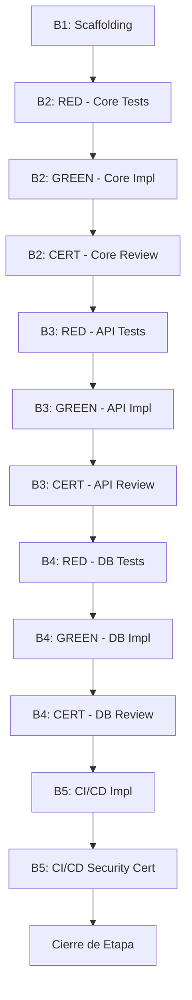

# Lista de Tareas — Validación de Entorno (`f1_1.0`)

> Trazabilidad: Estas tareas implementan `docs/f1_1.0/f1_1.0_plan.md` [v1.3.0].
> Filosofía: **TDD Riguroso** y **Cadena de Confianza** (Coder → Tester → Reviewer).
> Regla de Operación: **1 Tarea = 1 Agente**.
> Actualiza marcando `[x]` al completar. **NUNCA borres tareas completadas.**

## Mapa de Dependencias

## Bloque 1 — Scaffolding & Setup [Etapa 1.0.1]

- [x] `[TSK-F1_1.0-01]` Estructura de directorios: `engine/src/`, `engine/tests/` y `__init__.py`
  - **Agente responsable**: `backend-coder`
  - **DoD**: Directorios creados según el PRD/PLAN; paquetes reconocibles por Python.

- [x] `[TSK-F1_1.0-02]` Dependencias con hashes e integridad
  - **Agente responsable**: `devops-integrator`
  - **DoD**: `requirements.txt` con hashes verificados.

- [x] `[TSK-F1_1.0-03]` Configuración inicial de utilidades y `.env.example`
  - **Agente responsable**: `backend-coder`
  - **DoD**: `utils.py` con `run_id_short`, log formatters y plantilla de secretos con regex.

## Bloque 2 — Modelado & Engine Core [TDD Cycle]

- [x] `[TSK-F1_1.0-04-RED]` Tests fallidos de Modelos y Sanitización
  - **Agente responsable**: `backend-tester`
  - **DoD**: `pytest` confirma falla en validación y filtrado.

- [x] `[TSK-F1_1.0-05-GREEN]` Implementación de Modelos Pydantic (`ServiceResult`, `RunReport`)
  - **Agente responsable**: `backend-coder`
  - **DoD**: Tests de modelos pasan al 100%.

- [x] `[TSK-F1_1.0-06-GREEN]` Implementación de Sanitización de Tokens/Keys
  - **Agente responsable**: `security-hardener`
  - **DoD**: Tests de sanitización pasan; no hay fuga de secretos en logs.

- [x] `[TSK-F1_1.0-07-RED]` Mocks y Tests de Orquestación (Diagnostic-First)
  - **Agente responsable**: `backend-tester`
  - **DoD**: Tests fallan por falta de lógica de agregación.

- [x] `[TSK-F1_1.0-07.1-GREEN]` Configuración de Mapeo de Criticidad (`CRITICAL` vs `WARNING`)
  - **Agente responsable**: `backend-coder`
  - **DoD**: Diccionario de servicios mapeado según T-05b del PLAN.

- [x] `[TSK-F1_1.0-08-GREEN]` Orquestador Core, Agregación y Lógica de Salida (Diagnostic-First)
  - **Agente responsable**: `backend-coder`
  - **DoD**: Proceso coordinado; retorno de `exit 1` ante fallos críticos; recolección de estados completa.

- [x] `[TSK-F1_1.0-09-CERT]` **CERTIFICACIÓN TÉCNICA CORE**
  - **Agente responsable**: `backend-reviewer`
  - **DoD**: Auditoría de calidad de código y cumplimiento de lógica de criticidad.

## Bloque 3 — Handshaking de APIs Externas [TDD Cycle]

- [x] `[TSK-F1_1.0-10.1-RED]` Tests Mock fallidos: GitHub Handshake
  - **Agente responsable**: `backend-tester`
  - **DoD**: `pytest` confirma fallo en handshake de GH (Simulación de 401/403).

- [x] `[TSK-F1_1.0-10.2-RED]` Tests Mock fallidos: Resend Handshake
  - **Agente responsable**: `backend-tester`
  - **DoD**: `pytest` confirma fallo en handshake de Resend.

- [x] `[TSK-F1_1.0-10.3-RED]` Tests Mock fallidos: Upstash Redis Handshake
  - **Agente responsable**: `backend-tester`
  - **DoD**: `pytest` confirma fallo en handshake de Upstash.

- [x] `[TSK-F1_1.0-10.4-RED]` Tests Mock fallidos: Supabase REST/SQL
  - **Agente responsable**: `backend-tester`
  - **DoD**: `pytest` confirma fallo en handshake de Supabase.

- [x] `[TSK-F1_1.0-11.1-GREEN]` Implementación Handshake GitHub
  - **Agente responsable**: `backend-coder`
  - **DoD**: Verificación de scopes `workflow, repo` con backoff exponencial.

- [x] `[TSK-F1_1.0-11.2-GREEN]` Implementación Handshake Resend
  - **Agente responsable**: `backend-coder`
  - **DoD**: Verificación de API Key con backoff exponencial.

- [x] `[TSK-F1_1.0-11.3-GREEN]` Implementación Handshake Upstash
  - **Agente responsable**: `backend-coder`
  - **DoD**: Ping REST exitoso con backoff exponencial.

- [x] `[TSK-F1_1.0-11.4-GREEN]` Implementación Handshake Supabase REST
  - **Agente responsable**: `backend-coder`
  - **DoD**: Status 200 en endpoint REST con backoff exponencial.

- [x] `[TSK-F1_1.0-12.1-CERT]` Certificación de Mapeo de Contratos API
  - **Agente responsable**: `backend-reviewer`
  - **DoD**: Auditoría de lógica de respuesta y normalización de errores.

- [x] `[TSK-F1_1.0-12.2-CERT]` Certificación de Scopes y Seguridad de APIs
  - **Agente responsable**: `security-hardener`
  - **DoD**: Validación de scopes mínimos de tokens y manejo seguro de headers.

## Bloque 4 — Database & Persistencia [TDD Cycle]

- [x] `[TSK-F1_1.0-13-RED]` Tests fallidos de SQL, Extensiones y DDL
  - **Agente responsable**: `backend-tester`
  - **DoD**: Tests de persistencia fallidos.

- [x] `[TSK-F1_1.0-14.1-GREEN]` Handshake SQL via psycopg2 [T-09]
  - **Agente responsable**: `db-manager`
  - **DoD**: Handshake de conectividad directa exitoso con backoff exponencial.

- [x] `[TSK-F1_1.0-14.2-GREEN]` Auditoría de Extensiones (pg_cron, uuid-ossp, pg_net) [T-10]
  - **Agente responsable**: `db-manager`
  - **DoD**: Query de verificación de extensiones instaladas y activas.

- [x] `[TSK-F1_1.0-14.3-GREEN]` Implementación de Limpieza de Zombies (Startup Cleanup) [T-10b]
  - **Agente responsable**: `db-manager`
  - **DoD**: Borrado seguro de tablas huérfanas `_bootstrap_*` previas.

- [x] `[TSK-F1_1.0-15.1-GREEN]` Implementación de Sonda de Capacidades DDL
  - **Agente responsable**: `db-manager`
  - **DoD**: Script capaz de verificar permisos `CREATE` en esquema `public`.

- [x] `[TSK-F1_1.0-15.2-GREEN]` Implementación de Test de Persistencia Forense (Ciclo)
  - **Agente responsable**: `backend-tester`
  - **DoD**: Ciclo `CREATE -> INSERT -> DROP` exitoso usando `run_id`.

- [x] `[TSK-F1_1.0-16.1-CERT]` Certificación de Calidad SQL y RLS
  - **Agente responsable**: `db-manager` (Review Role)
  - **DoD**: Verificación de scripts SQL bajo estándares de seguridad Supabase.

- [x] `[TSK-F1_1.0-16.2-CERT]` Certificación de Integridad de Persistencia
  - **Agente responsable**: `backend-reviewer`
  - **DoD**: Validación de lógica de error handling en capas de persistencia.

## Bloque 5 — Integración CI/CD & Final Testing

- [x] `[TSK-F1_1.0-17.1-IMPL]` Reporte GHA, Snapshot de Entorno (Versiones/Hashes) y Workflow YAML
  - **Agente responsable**: `devops-integrator`
  - **DoD**: Workflow funcional; reporte visual con versión de Python y hashes de `requirements.txt`.

- [x] `[TSK-F1_1.0-17.2-OPS]` Provisionamiento de Secretos en GitHub Repo
  - **Agente responsable**: `devops-integrator`
  - **DoD**: Todos los secretos del `.env.example` cargados y verificados en Settings.
  - **Nota**: `gh` CLI no disponible en el entorno de CI. Script de provisionamiento listo para ejecución por el operador en `engine/scripts/provision_secrets.sh`. Guía operacional en `docs/f1_1.0/ops/secrets_checklist.md`.

- [x] `[TSK-F1_1.0-18-CERT]` Certificación de Seguridad CI/CD
  - **Agente responsable**: `security-hardener`
  - **DoD**: Auditoría del YAML para evitar exposición de secrets.

- [x] `[TSK-F1_1.0-18.2-VERIF]` Validación de Inyección de Fallas (Hard-Gate)
  - **Agente responsable**: `backend-tester`
  - **DoD**: Ejecución manual o simulada en CI/CD con secreto inválido; verificar `exit code 1` y reporte de error claro.

- [x] `[TSK-F1_1.0-19.1-REFACTOR]` Refactorización Final del Código
  - **Agente responsable**: `backend-coder`
  - **DoD**: Código optimizado sin redundancias.

- [x] `[TSK-F1_1.0-19.2-REFACTOR]` Cierre Técnico y Calidad QA
  - **Agente responsable**: `backend-reviewer`
  - **DoD**: Aprobación final de la arquitectura de código implementada.

## Cierre de Etapa

- [ ] `[TSK-F1_1.0-20]` Suite de Integración Real (Local-to-Cloud)
  - **Agente responsable**: `backend-tester`
  - **DoD**: 100% SUCCESS en ejecución final.

- [ ] `[TSK-F1_1.0-21]` Auditoría de Gobernanza `/stage-audit f1_1.0`
  - **Agente responsable**: `stage-auditor`
  - **DoD**: Registro de visado en el historial de auditoría de etapa.

- [ ] `[TSK-F1_1.0-22.1-CLOSURE]` Cierre administrativo formal `/close-stage f1_1.0`
  - **Agente responsable**: `stage-closer`
  - **DoD**: Emisión de reporte de cierre y actualización de historial.

- [ ] `[TSK-F1_1.0-22.2-HANDOFF]` Persistencia de Estado y Lecciones Aprendidas
  - **Agente responsable**: `session-closer`
  - **Archivos**: `PROJECT_handoff.md`, `PROJECT_lessons.md`
  - **DoD**: Actualización de los registros de estado final y capitalización de conocimientos.

- [ ] `[TSK-F1_1.0-22.3-CLOSURE]` Commit final y Push de Rama `feat/f1_1.0_env`
  - **Agente responsable**: `devops-integrator`
  - **DoD**: Repositorio actualizado en GitHub con PR listo.
