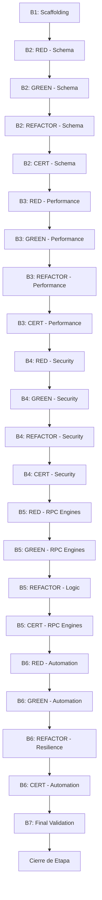

# Lista de Tareas — Setup de Supabase & DDL (`f1_1.1`)

> Trazabilidad: Estas tareas implementan `docs/f1_1.1/f1_1.1_plan.md` [v1.5.0].
> Filosofía: **TDD Riguroso** y **Cadena de Confianza** (Coder → Tester → Reviewer).
> Regla de Operación: **1 Tarea Micro-Atómica = 1 Única Actividad = 1 Único Agente** según su especialidad en `.claude/agents-router.md`.
> Actualiza marcando `[x]` al completar. **NUNCA borres tareas completadas.**

## Mapa de Dependencias de Implementación

---

## Bloque 0/1 — Validación & Scaffolding [Micro-Setup]

- [ ] `[TSK-F1_1.1-01.1]` **[EJECUTAR]**: Configuración de `supabase/config.toml` (hilos de pg_cron).
  - **Agente responsable**: `devops-integrator`
  - **DoD**: Archivo config.toml actualizado; soporte para cronjobs habilitado.
- [ ] `[TSK-F1_1.1-01.2]` **[EJECUTAR]**: Hardening de `db.extra_search_path` en config de Supabase.
  - **Agente responsable**: `devops-integrator`
  - **DoD**: `extra_search_path` configurado para restringir visibilidad de esquemas internos.
- [ ] `[TSK-F1_1.1-02.1]` **[VALIDAR]**: Verificación de extensiones habilitadas (`pg_cron`, `pg_net`, `pgtap`).
  - **Agente responsable**: `backend-tester`
  - **DoD**: Query SQL confirma estado 'installed' para las 3 extensiones.
- [ ] `[TSK-F1_1.1-02.1.1]` **[VALIDAR]**: Verificación de versión del motor Postgres (>= 15.0).
  - **Agente responsable**: `backend-tester`
  - **DoD**: `SHOW server_version` reporta versión >= 15.0 (Mandatado por PLAN B0).
- [ ] `[TSK-F1_1.1-02.2]` **[VALIDAR]**: Verificación de disponibilidad de funciones `IMMUTABLE` en el motor Postgres.
  - **Agente responsable**: `backend-tester`
  - **DoD**: Smoke test confirma que funciones deterministas operan sin efectos secundarios.
- [ ] `[TSK-F1_1.1-02.3]` **[VALIDAR]**: Prueba de conectividad del runner `pgtap` con el esquema local/dev.
  - **Agente responsable**: `backend-tester`
  - **DoD**: `pg_prove` ejecuta exitosamente un test 'dummy'.
- [ ] `[TSK-F1_1.1-03.1]` **[VALIDAR]**: Test pgTap: Verificación de `search_path` restrictivo en esquemas de sistema/app.
  - **Agente responsable**: `backend-tester`
  - **DoD**: Test falla si el `search_path` incluye esquemas no autorizados.
- [ ] `[TSK-F1_1.1-03.2]` **[CERTIFICAR]**: Certificación de conformidad del entorno (Gate 0).
  - **Agente responsable**: `stage-auditor`
  - **DoD**: Entorno validado y reportado como apto para DDL.
- [ ] `[TSK-F1_1.1-03.3]` **[EJECUTAR]**: Reset determinista de la base de datos local (`supabase db reset`).
  - **Agente responsable**: `devops-integrator`
  - **DoD**: Base de datos limpia de residuos de pre-vuelo; lista para aplicación de migraciones granulares.

---

## Bloque 2 — Esquema Core & Singleton [TDD Cycle]

- [ ] `[TSK-F1_1.1-04.1-RED]` **[VALIDAR]**: Test pgTap: Restricción Singleton (Check `id=1` failure).
  - **Agente responsable**: `backend-tester`
  - **DoD**: Test falla si se permite insertar un segundo registro en `system_configuration`.
- [ ] `[TSK-F1_1.1-04.2-RED]` **[VALIDAR]**: Test pgTap: Bloqueo de DELETE en `system_configuration`.
  - **Agente responsable**: `backend-tester`
  - **DoD**: Test falla si se permite borrar el Singleton.
- [ ] `[TSK-F1_1.1-04.3-RED]` **[VALIDAR]**: Test pgTap: Inexistencia de constantes administrativas (seed check fail).
  - **Agente responsable**: `backend-tester`
  - **DoD**: Test falla ante la ausencia de UUID administrativo.
- [ ] `[TSK-F1_1.1-04.4-RED]` **[VALIDAR]**: Test pgTap: Integridad referencial y constraints de array en `draws`.
  - **Agente responsable**: `backend-tester`
  - **DoD**: Test falla si se permiten arrays de bolas duplicados o mal formateados.
- [ ] `[TSK-F1_1.1-04.5-RED]` **[VALIDAR]**: Test pgTap: Lógica de validación de bolas (`fn_validate_ball_array`).
  - **Agente responsable**: `backend-tester`
  - **DoD**: Test falla si la función no detecta correctamente duplicados, números fuera de rango (1-100) o desorden.
- [ ] `[TSK-F1_1.1-05.1-GREEN]` **[EJECUTAR]**: Creación de tabla `system_configuration` con PK fija.
  - **Agente responsable**: `db-manager`
  - **DoD**: Tabla creada con constraint `CHECK (id = 1)`.
- [ ] `[TSK-F1_1.1-05.2-GREEN]` **[EJECUTAR]**: Implementación del trigger `tg_prevent_singleton_delete`.
  - **Agente responsable**: `db-manager`
  - **DoD**: Trigger activo y bloqueando operaciones `DELETE` en el Singleton.
- [ ] `[TSK-F1_1.1-05.3-GREEN]` **[EJECUTAR]**: Creación de tabla `draws` con constraint de unicidad temporal.
  - **Agente responsable**: `db-manager`
  - **DoD**: Tabla creada; índice único en `(draw_date, type)` activo.
- [ ] `[TSK-F1_1.1-05.4-GREEN]` **[EJECUTAR]**: Creación de tabla `manual_verification_queue`.
  - **Agente responsable**: `db-manager`
  - **DoD**: Tabla creada con llaves foráneas a `draws`.
- [ ] `[TSK-F1_1.1-05.5-GREEN]` **[EJECUTAR]**: Creación de tabla `system_logs` para auditoría forense.
  - **Agente responsable**: `db-manager`
  - **DoD**: Tabla creada con columna `metadata JSONB` para backups.
- [ ] `[TSK-F1_1.1-05.6-GREEN]` **[EJECUTAR]**: Implementación de función `fn_validate_ball_array` (Lógica Stable).
  - **Agente responsable**: `db-manager`
  - **DoD**: Función retorna `BOOLEAN` validando unicidad y rango de bolas.
- [ ] `[TSK-F1_1.1-05.7-GREEN]` **[EJECUTAR]**: Inyección de Semillas (Admin & Config) y generación de Migración B1/B2.
  - **Agente responsable**: `devops-integrator`
  - **DoD**: Seed inyecta registro inicial incluyendo `admin_uuid`, `debt_threshold_hours` (24h) e `is_system_locked` (false); Archivo de migración `[TIMESTAMP]_block_1_2.sql` persistido en `/migrations`.
- [ ] `[TSK-F1_1.1-06.1-REFACT]` **[REFACTOR]**: Consolidación de constraints de chequeo y normalización de tipos DDL.
  - **Agente responsable**: `db-manager`
  - **DoD**: DDL optimizado; tipos de datos ajustados a la SPEC.
- [ ] `[TSK-F1_1.1-07.1-CERT]` **[CERTIFICAR]**: Auditoría de trazabilidad PRD vs DDL.
  - **Agente responsable**: `stage-auditor`
  - **DoD**: Mapeo 1:1 confirmado entre requisitos y tablas.
- [ ] `[TSK-F1_1.1-07.2-CERT]` **[CERTIFICAR]**: Análisis de Ghost Code en el esquema transaccional.
  - **Agente responsable**: `stage-auditor`
  - **DoD**: Confirmada inexistencia de columnas o triggers no especificados.

---

## Bloque 3 — Motor de Performance [TDD Cycle]

- [ ] `[TSK-F1_1.1-08.1-RED]` **[VALIDAR]**: Test pgTap: Idempotencia en inserción de proyecciones duplicadas.
  - **Agente responsable**: `backend-tester`
  - **DoD**: Test falla si se permiten proyecciones redundantes para la misma estrategia/fecha.
- [ ] `[TSK-F1_1.1-08.2-RED]` **[VALIDAR]**: Test pgTap: Verificación del mecanismo de chunking (1000 recs) en bulk insert.
  - **Agente responsable**: `backend-tester`
  - **DoD**: Test falla si la función de inserción masiva no particiona los datos.
- [ ] `[TSK-F1_1.1-09.1-GREEN]` **[EJECUTAR]**: Creación de tabla `strategies_metadata`.
  - **Agente responsable**: `db-manager`
  - **DoD**: Tabla creada con metadatos de performance inicial.
- [ ] `[TSK-F1_1.1-09.2-GREEN]` **[EJECUTAR]**: Creación de tabla `projections` con columnas de trazabilidad asíncrona y resiliencia.
  - **Agente responsable**: `db-manager`
  - **DoD**: Tabla creada incluyendo `last_heartbeat`, `worker_id`, `retry_count` (int) y `status` (enum: pending, processing, completed, error_fatal).
- [ ] `[TSK-F1_1.1-09.3-GREEN]` **[EJECUTAR]**: Creación de tabla `performance` con columna generada `score`.
  - **Agente responsable**: `db-manager`
  - **DoD**: Tabla creada; columna virtual `score` calculada según fórmula de la SPEC.
- [ ] `[TSK-F1_1.1-09.4-GREEN]` **[EJECUTAR]**: Implementación de `fn_bulk_insert_projections` (Chunking & Idempotencia) y Migración B3.
  - **Agente responsable**: `db-manager`
  - **DoD**: Función PL/pgSQL operativa con loops de 1000 registros y cláusulas `ON CONFLICT` para garantizar idempotencia; Archivo de migración `[TIMESTAMP]_block_3.sql` generado.
- [ ] `[TSK-F1_1.1-10.1-GREEN]` **[EJECUTAR]**: Despliegue de índice GIN `idx_projections_numbers`.
  - **Agente responsable**: `db-manager`
  - **DoD**: Índice GIN activo en `projections.numbers` para búsqueda de arrays.
- [ ] `[TSK-F1_1.1-10.2-GREEN]` **[EJECUTAR]**: Despliegue de índice compuesto `idx_performance_tiebreak`.
  - **Agente responsable**: `db-manager`
  - **DoD**: Índice activo en `(strategy_id, score, created_at)` para desempates.
- [ ] `[TSK-F1_1.1-11.1-REFACT]` **[REFACTOR]**: Optimización de planes de ejecución mediante estadísticas y ajuste de índices.
  - **Agente responsable**: `db-manager`
  - **DoD**: `EXPLAIN ANALYZE` confirma uso eficiente de índices en queries core.
- [ ] `[TSK-F1_1.1-12-CERT]` **[CERTIFICAR]**: Auditoría de performance SQL y calidad de índices.
  - **Agente responsable**: `backend-reviewer`
  - **DoD**: Aprobación técnica de la estrategia de indexación y particionamiento.

---

## Bloque 4 — Seguridad & RLS [TDD Cycle]

- [ ] `[TSK-F1_1.1-13.1-RED]` **[VALIDAR]**: Test pgTap: Denegación fail-closed en ausencia de contexto (COALESCE check).
  - **Agente responsable**: `backend-tester`
  - **DoD**: Test falla si una política RLS permite acceso cuando la variable de sesión es nula.
- [ ] `[TSK-F1_1.1-13.2-RED]` **[VALIDAR]**: Test pgTap: Verificación de `search_path` restrictivo en funciones `SECURITY DEFINER`.
  - **Agente responsable**: `backend-tester`
  - **DoD**: Test falla si una función tiene acceso a esquemas no declarados expresamente.
- [ ] `[TSK-F1_1.1-13.3-RED]` **[VALIDAR]**: Test pgTap: Matriz de Acceso - Rol `web_anon` (Deny All).
  - **Agente responsable**: `backend-tester`
  - **DoD**: Test falla si el rol anónimo visualiza más de 0 registros.
- [ ] `[TSK-F1_1.1-13.4-RED]` **[VALIDAR]**: Test pgTap: Matriz de Acceso - Rol `authenticated` (Restricted).
  - **Agente responsable**: `backend-tester`
  - **DoD**: Test falla si un usuario autenticado accede a tablas de configuración.
- [ ] `[TSK-F1_1.1-13.5-RED]` **[VALIDAR]**: Test pgTap: Matriz de Acceso - Rol `service_role` (Full Access).
  - **Agente responsable**: `backend-tester`
  - **DoD**: Test falla si el rol de servicio no tiene bypass de RLS operativo.
- [ ] `[TSK-F1_1.1-14.1-GREEN]` **[EJECUTAR]**: Hardening de `fn_setup_security_context` (Inyección de app.current_admin_id).
  - **Agente responsable**: `security-hardener`
  - **DoD**: Función valida el JWT y setea variables de entorno local seguras.
- [ ] `[TSK-F1_1.1-14.2-GREEN]` **[EJECUTAR]**: Implementación de políticas RLS en tablas de configuración (System Domain).
  - **Agente responsable**: `db-manager`
  - **DoD**: Políticas `USING` incorporan `COALESCE` y chequeo de `admin_uuid`.
- [ ] `[TSK-F1_1.1-14.3-GREEN]` **[EJECUTAR]**: Implementación de políticas RLS en tablas transaccionales (Business Domain).
  - **Agente responsable**: `db-manager`
  - **DoD**: Acceso público (`anon`) restringido; acceso `auth` limitado por lógica de negocio.
- [ ] `[TSK-F1_1.1-15.1-GREEN]` **[EJECUTAR]**: Configuración de permisos y generación de Migración B4.
  - **Agente responsable**: `security-hardener`
  - **DoD**: `GRANT` ejecutado; `service_role` con permisos cron; Archivo de migración `[TIMESTAMP]_block_4.sql` generado con todas las políticas RLS.
- [ ] `[TSK-F1_1.1-16.1-REFACT]` **[REFACTOR]**: Estandarización de plantillas de seguridad RLS para evitar duplicidad de lógica.
  - **Agente responsable**: `db-manager`
  - **DoD**: Políticas unificadas bajo funciones de chequeo comunes.
- [ ] `[TSK-F1_1.1-17-CERT]` **[CERTIFICAR]**: Certificación técnica de invulnerabilidad y políticas RLS.
  - **Agente responsable**: `security-hardener`
  - **DoD**: Auditoría final de seguridad confirma cumplimiento del ADR de Seguridad.

---

## Bloque 5 — Motores RPC [TDD Cycle]

- [ ] `[TSK-F1_1.1-18.1-RED]` **[VALIDAR]**: Test pgTap: Snapshotting de parámetros (inmovilidad ante cambios en system_config).
  - **Agente responsable**: `backend-tester`
  - **DoD**: Test falla si una variable de sesión cambia tras haber sido capturada al inicio.
- [ ] `[TSK-F1_1.1-18.2-RED]` **[VALIDAR]**: Test pgTap: Resolución de conflictos de promoción (Admin > Scraper).
  - **Agente responsable**: `backend-tester`
  - **DoD**: Test falla si un resultado de Scraper sobreescribe un registro manual de Admin.
- [ ] `[TSK-F1_1.1-18.3-RED]` **[VALIDAR]**: Test pgTap: Bloqueo de promoción ante discrepancia activa (`is_conflict=TRUE`).
  - **Agente responsable**: `backend-tester`
  - **DoD**: Test falla si se promociona un sorteo con advertencia de conflicto sin resolver.
- [ ] `[TSK-F1_1.1-18.4-RED]` **[VALIDAR]**: Test pgTap: Atomicidad de transacciones ante fallos parciales (Savepoint Trigger).
  - **Agente responsable**: `backend-tester`
  - **DoD**: Test falla si una transacción deja estados inconsistentes tras un error forzado.
- [ ] `[TSK-F1_1.1-18.5-RED]` **[VALIDAR]**: Test pgTap: Integridad de Backup Forense (Falla si el backup en `system_logs` no se completa).
  - **Agente responsable**: `backend-tester`
  - **DoD**: Test falla si la tabla de logs no contiene el snapshot JSONB previo al recálculo.
- [ ] `[TSK-F1_1.1-18.6-RED]` **[VALIDAR]**: Test pgTap: Simulación de cambio de configuración `mid-flight` (Verificar persistencia de Snapshot).
  - **Agente responsable**: `backend-tester`
  - **DoD**: Test falla si el motor de scoring usa un valor nuevo inyectado a mitad del proceso.
- [ ] `[TSK-F1_1.1-19.1-GREEN]` **[EJECUTAR]**: Implementación de `fn_compute_async_scoring` con lógica `SKIP LOCKED` y Snapshotting.
  - **Agente responsable**: `db-manager`
  - **DoD**: Función PL/pgSQL operativa; implementa Batch Size 428, captura de parámetros de configuración al inicio (Snapshot) y evita colisiones entre workers.
- [ ] `[TSK-F1_1.1-19.2-GREEN]` **[EJECUTAR]**: Implementación de `fn_verify_and_promote_draw` (Prioridad Admin).
  - **Agente responsable**: `db-manager`
  - **DoD**: Transición de estado a verificado con prioridad mandatoria de `Admin > Scraper` (`ORDER BY created_at DESC`); verificación de backup previo; Archivo de migración `[TIMESTAMP]_block_5a.sql` generado.
- [ ] `[TSK-F1_1.1-19.3-GREEN]` **[EJECUTAR]**: Implementación de lógica Matching Ghost (>24h) en recálculo.
  - **Agente responsable**: `db-manager`
  - **DoD**: Recálculo atómico disparado ante discrepancias temporales según ADR-04.
- [ ] `[TSK-F1_1.1-19.4-GREEN]` **[EJECUTAR]**: Lógica de respaldo forense en `system_logs.metadata` antes de truncado.
  - **Agente responsable**: `db-manager`
  - **DoD**: Inserción `JSONB_AGG` del estado previo de performance en logs técnica confirmada.
- [ ] `[TSK-F1_1.1-19.5-GREEN]` **[EJECUTAR]**: Gestión de `retry_count` y transiciones a `error_fatal` en RPC Scoring.
  - **Agente responsable**: `db-manager`
  - **DoD**: Mecanismo de reintento activo; registros problemáticos marcados tras N fallos.
- [ ] `[TSK-F1_1.1-20.1-REFACT]` **[REFACTOR]**: Modularización de bloques PL/pgSQL para reducir complejidad ciclomática.
  - **Agente responsable**: `db-manager`
  - **DoD**: Código dividido en sub-funciones mantenibles; linter SQL conforme.
- [ ] `[TSK-F1_1.1-21-CERT]` **[CERTIFICAR]**: Auditoría de calidad lógica y cierre técnico RPC.
  - **Agente responsable**: `backend-reviewer`
  - **DoD**: Certificación de cumplimiento de los contratos de la SPEC para lógica RPC.

---

## Bloque 6 — Automatización & Orquestación [TDD Cycle]

- [ ] `[TSK-F1_1.1-22.1-RED]` **[VALIDAR]**: Test pgTap: Reseteo determinista de registros con latido antiguo (>30m).
  - **Agente responsable**: `backend-tester`
  - **DoD**: Test falla si se resetea un worker_id con latido inferior a 30m.
- [ ] `[TSK-F1_1.1-22.2-RED]` **[VALIDAR]**: Test pgTap: Detección y activación de modo fallback.
  - **Agente responsable**: `backend-tester`
  - **DoD**: Test falla si el sistema no activa el flag de fallback ante retrasos > 24h.
- [ ] `[TSK-F1_1.1-23.1-GREEN]` **[EJECUTAR]**: Creación de tabla `sync_locks` con TTL de 60m.
  - **Agente responsable**: `db-manager`
  - **DoD**: Tabla creada; registro de locks operativos.
- [ ] `[TSK-F1_1.1-23.2-GREEN]` **[EJECUTAR]**: Implementación de `fn_manage_lock`.
  - **Agente responsable**: `db-manager`
  - **DoD**: Función capaz de adquirir y liberar locks con validación de expiración.
- [ ] `[TSK-F1_1.1-23.3-GREEN]` **[EJECUTAR]**: Implementación de `fn_recover_stalled_projections`.
  - **Agente responsable**: `db-manager`
  - **DoD**: Mecanismo de recuperación limpia locks y registros zombies de forma segura.
- [ ] `[TSK-F1_1.1-23.4-GREEN]` **[EJECUTAR]**: Implementación de `fn_monitor_and_activate_fallback`.
  - **Agente responsable**: `db-manager`
  - **DoD**: Activación automática de fallback detectada en logs tras simular retraso.
- [ ] `[TSK-F1_1.1-24.1-GREEN]` **[EJECUTAR]**: Programación de jobs en `pg_cron` y generación de Migración B5b.
  - **Agente responsable**: `devops-integrator`
  - **DoD**: Jobs programados con `SET LOCAL statement_timeout = '55min'`; Archivo de migración `[TIMESTAMP]_block_5b.sql` generado incluyendo orquestación.
- [ ] `[TSK-F1_1.1-25.1-REFACT]` **[REFACTOR]**: Afinamiento de intervalos de cron para evitar solapamiento de transacciones pesadas.
  - **Agente responsable**: `devops-integrator`
  - **DoD**: Configuración cron optimizada; sin cruces de locks detectados en 5 iteraciones.
- [ ] `[TSK-F1_1.1-26-CERT]` **[CERTIFICAR]**: Auditoría de resiliencia operativa y orquestación.
  - **Agente responsable**: `backend-reviewer`
  - **DoD**: Certificación de que el sistema se auto-recupera de fallos de concurrencia.

---

## Bloque 7 — Observabilidad & Cierre Final [TDD Cycle]

- [ ] `[TSK-F1_1.1-26.1-RED]` **[VALIDAR]**: Test pgTap: Integridad y cálculo de métricas en `v_system_health`.
  - **Agente responsable**: `backend-tester`
  - **DoD**: Test falla si la vista no reporta correctamente registros en estado 'error_fatal'.
- [ ] `[TSK-F1_1.1-26.2-RED]` **[VALIDAR]**: Test pgTap: Validación de desvíos en `v_strategy_delta`.
  - **Agente responsable**: `backend-tester`
  - **DoD**: Test falla si el cálculo de delta de performance es incorrecto según la SPEC.
- [ ] `[TSK-F1_1.1-26.3-RED]` **[VALIDAR]**: Test pgTap: Lógica de purga en `fn_cleanup_logs`.
  - **Agente responsable**: `backend-tester`
  - **DoD**: Test falla si la función borra registros que no han excedido el TTL de retención.
- [ ] `[TSK-F1_1.1-27.1-GREEN]` **[EJECUTAR]**: Implementación de vista `v_system_health`.
  - **Agente responsable**: `db-manager`
  - **DoD**: Vista operacional; reporta estados 'error_fatal' y latencia de scoring.
- [ ] `[TSK-F1_1.1-27.2-GREEN]` **[EJECUTAR]**: Implementación de vista `v_strategy_delta`.
  - **Agente responsable**: `db-manager`
  - **DoD**: Vista operacional; calcula desvíos de performance por estrategia.
- [ ] `[TSK-F1_1.1-27.3-GREEN]` **[EJECUTAR]**: Lógica de purga y generación de Migración B6.
  - **Agente responsable**: `db-manager`
  - **DoD**: Función purga registros viejos; cronjob activo; Archivo de migración `[TIMESTAMP]_block_6.sql` generado con vistas v_system_health y v_strategy_delta.
- [ ] `[TSK-F1_1.1-28.1-GREEN]` **[EJECUTAR]**: Script de carga de datos sintéticos (428 registros).
  - **Agente responsable**: `db-manager`
  - **DoD**: Inserción exitosa de datos de prueba para validación de carga.
- [ ] `[TSK-F1_1.1-29.1-VERIF]` **[VALIDAR]**: Ejecución de Suite de Integración Funcional (Contratos SPEC).
  - **Agente responsable**: `integration-tester`
  - **DoD**: Validación de integridad referencial y lógica RPC exitosa (M3 del PLAN).
- [ ] `[TSK-F1_1.1-29.2-VERIF]` **[VALIDAR]**: Ejecución de Suite de Stress & Performance E2E (M6).
  - **Agente responsable**: `integration-tester`
  - **DoD**: Procesamiento de 428 registros en < 500ms validado en entornos simulados.

## Cierre de Etapa
- [ ] `[TSK-F1_1.1-30]` Ejecutar auditoría de etapa `/stage-audit f1_1.1` _(depends_on: todas las anteriores)_
  - **Agente responsable**: `stage-auditor`
  - **DoD**: Registro de visado en el historial de auditoría de etapa.
- [ ] `[TSK-F1_1.1-31]` Ejecutar cierre formal `/close-stage f1_1.1` — genera documento ejecutivo _(depends_on: auditoría aprobada)_
  - **Agente responsable**: `stage-closer`
  - **DoD**: Emisión de reporte de cierre y actualización de historial.
- [ ] `[TSK-F1_1.1-31.1]` Persistencia de Estado y Lecciones Aprendidas
  - **Agente responsable**: `session-closer`
  - **Archivos**: `PROJECT_handoff.md`, `lessons-learned.md`
  - **DoD**: Actualización de los registros de estado final y capitalización de conocimientos.
- [ ] `[TSK-F1_1.1-32]` Commit final y Push de Rama `feat/f1_e1_setup_supabase_ddl`
  - **Agente responsable**: `devops-integrator`
  - **DoD**: Repositorio actualizado en GitHub con PR listo.

---

## 🏁 Definition of Done (DoD) Global
- [ ] Todas las tareas micro-atómicas verificadas con `[x]`.
- [ ] 100% de cobertura de la SPEC v1.2.3 validada por `pgtap`.
- [ ] Ciclo TDD (Red-Green-Refactor) completado en todos los bloques técnicos.
- [ ] Políticas RLS verificadas contra la matriz de seguridad.
- [ ] Todos los tokens de validación emitidos en `audit/sdd/` y token SDD final persistido.

