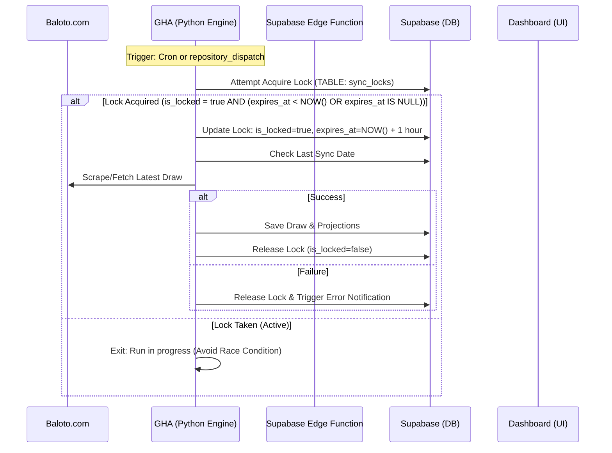

# PROJECT_architecture.md: DonTolto (Technical Architecture)

---
**Estado**: `ACTIVO` (Arquitectura Evolutiva y Autorizada)
**Fecha**: 2026-04-06
**Arquitecto**: Antigravity (Senior Software Architect)
---

## 🧩 Estilo Arquitectónico (Style)

El sistema **DonTolto** no es un monolito tradicional ni una red de microservicios. Se clasifica técnicamente como una **Arquitectura en Capas Desacopladas y Orquestada (Serverless Orchestrated Architecture)**.

### Características Principales:
- **Desacoplamiento Total**: El **Motor de Cálculo (Engine)** es efímero (GitHub Actions) y vive separado del **Dashboard (Next.js)**, comunicándose exclusivamente a través de la **Capa de Datos (Supabase)**.
- **Event-Driven & Orchestrated**: La lógica se dispara mediante eventos (Cron schedules o Manual Dispatches) orquestados por **Supabase Edge Functions**.
- **Stack Políglota**: Se utiliza cada tecnología para su fuerte: **Python 3.12+ / NumPy** para simulación de 1M escenarios y **Next.js 16+ / TypeScript 6+ / Tailwind 4** para la gestión y visualización de datos.

---

## 🏗️ Visión de Capas (System Overview)

El sistema se divide en tres capas fundamentales, desacoplando la computación intensiva de la visualización y la persistencia.

| Capa | Responsabilidad | Stack Técnico |
| :--- | :--- | :--- |
| **Motor (Logic Engine)** | Scraping, Simulación (1M) y Validación de Esquemas. | Python 3.12+, Pandera/Pydantic, GitHub Actions, NumPy. |
| **Datos (Persistence)** | Almacenamiento, Benchmarking SQL, Cleanup (Cron) y Realtime. | Supabase, pg_cron, pg_net, PostgREST, Redis. |
| **Frontend (UI)** | Dashboard Reactivo, Carga Manual y Monitoreo Realtime. | Next.js 16+, Supabase Realtime, Tailwind 4. |
| **Integración (Trigger)** | Disparo de motor y automatización de métricas. | Supabase Edge Functions / DB Triggers -> GitHub API. |

---

## 📂 Estructura de Proyecto (Folder Hierarchy)

Para garantizar el desacoplamiento entre el **Motor Python**, la **Persistencia en Supabase** y el **Dashboard Next.js**, se implementará la siguiente estructura de carpetas:

```text
DonTolto/
├── .github/
│   └── workflows/              # GitHub Actions (Engine, Sync & Deployment)
│       ├── engine-sync.yml      # Cron 1:30am COT & Manual Dispatches
│       └── web-deploy.yml       # Next.js CD (Opcional)
├── docs/
│   ├── governance/             # PROJECT_scope.md, PROJECT_architecture.md
│   └── architecture/           # Fuentes de Mermaid y diagramas técnicos
├── engine/ (Python 3.12+)
│   ├── src/
│   │   ├── scraper/            # Lógica de Scraping (Baloto/Revancha)
│   │   ├── simulator/          # Lógica NumPy 1M escenarios (Memoria Pura)
│   │   ├── generator/          # Generación de Estrategias (Elite/Real)
│   │   └── main.py             # Orquestador (Entrypoint para GHA)
│   ├── tests/                  # Pruebas unitarias/integración del motor
│   ├── requirements.txt        # Dependencias (NumPy, Pandas, Requests)
│   └── .env.example            # Variables de entorno requeridas
├── supabase/ (Postgres)
│   ├── migrations/             # SQL DDL (Draws, Projections, Performance)
│   ├── functions/              # Supabase Edge Functions
│   │   └── dispatch-engine/     # Trigger para invocar GitHub API
│   └── seed.sql                # Datos iniciales (Estrategias/Sorteos)
└── web/ (Next.js 16+ & TypeScript 6+)
    ├── app/                    # App Router (Dashboard & Admin)
    ├── components/             # Componentes UI (Tailwind 4 Premium)
    ├── lib/                    # Wrappers de Supabase/Upstash Clients
    ├── styles/                 # global.css y estilos por componente
    ├── public/                 # Assets (Logos, Iconos, Imágenes)
    └── .env.local              # Configuración local de dev
```

---

## 🔄 Flujo de Datos y Orquestación

### Diagrama de Secuencia (Blindaje de Concurrencia)



### Orquestación (Schedules & Safety)
- **Sincronización (Sync)**: Martes, Jueves y Domingos a la 1:30 am COT (`cron: "30 6 * * 2,4,0"` UTC).
- **Mecanismo de Lock**: Tabla `sync_locks` con **TTL de 60 minutos**. La adquisición es **atómica**.
- **Trazabilidad (Traceability)**: Se genera un **`run_id` (UUID)** en la Edge Function que se propaga a GHA y se almacena en todos los registros de ese ciclo.
- **Integración Manual (Trigger)**:
    - **Edge Function**: Verifica lock, genera `run_id`, y llama a la **GitHub API** con el payload de trazabilidad. Requiere `GITHUB_TOKEN` y `UPSTASH_REDIS_REST_TOKEN`.
- **Fail-Safe Orchestration**: 
    - El Motor de GHA tiene un timeout de 25 min (interno).
    - **Trigger de Rescate**: Uso de `if: failure()` para envío proactivo vía Resend API.
    - **Grace Period**: El motor monitorea su tiempo y dispara el backup Elite al minuto 23 si no ha terminado.
- **Data Management (Archivado Histórico)**:
    - **Retención**: Proyecciones vinculadas a performance se conservan 12 meses.
    - **Cleanup**: Los logs de nivel `info` en `system_logs` y entradas verificadas en `manual_verification_queue` se purgan automáticamente tras 90 días mediante un DB Cron.
- **Compute Efficiency (GHA Optimization)**:
    - Uso de **Docker-based Runners** o **GitHub Actions Cache** para dependencias NumPy/Pandas.
    - **Budget**: Tiempo objetivo de ejecución < 12 minutos (excluyendo el timeout de 25m de fail-safe).

---

## 📦 Contrato de Interfaz (Scraper -> Supabase)

El objeto JSON enviado a la Edge Function o guardado via RPC debe seguir esta estructura estricta:

```typescript
interface DrawPayload {
  run_id: string;          // UUID para trazabilidad cruzada
  draw_date: string;       // ISO 8601 (YYYY-MM-DD)
  type: 'baloto' | 'revancha';
  numbers: number[];       // [n1, n2, n3, n4, n5] (1-43)
  superbalota: number;     // 1-16
  is_manual: boolean;
}
```

---

## 💾 Especificación de Datos (DDL)

### Tablas Consolidadas (Revisadas)

```sql
-- 0. Extensiones Requeridas
CREATE EXTENSION IF NOT EXISTS "uuid-ossp";
CREATE EXTENSION IF NOT EXISTS "pg_cron"; -- Requerido para Cleanup automático
CREATE EXTENSION IF NOT EXISTS "pg_net";  -- Opcional (Notificaciones externas)

-- 0.1 Metadatos de Estrategias (Evolutivo)
CREATE TABLE strategies_metadata (
    name VARCHAR(50) PRIMARY KEY,
    role VARCHAR(20) CHECK (role IN ('control', 'active', 'archive')),
    version INTEGER DEFAULT 1,
    description TEXT,
    updated_at TIMESTAMP WITH TIME ZONE DEFAULT NOW()
);

-- 1. Sorteos Reales
CREATE TABLE draws (
    id UUID PRIMARY KEY DEFAULT gen_random_uuid(),
    run_id UUID, -- Referencia al ciclo de ejecución
    draw_date DATE NOT NULL,
    numbers INTEGER[] NOT NULL CHECK (cardinality(numbers) = 5),
    superbalota INTEGER NOT NULL CHECK (superbalota BETWEEN 1 AND 16),
    type VARCHAR(20) NOT NULL CHECK (type IN ('baloto', 'revancha')),
    is_manual BOOLEAN DEFAULT FALSE,
    created_at TIMESTAMP WITH TIME ZONE DEFAULT NOW(),
    UNIQUE(draw_date, type)
);

-- 1.1 Cola de Verificación Manual (Double-Entry)
-- REGLA: Los registros solo pasan a 'draws' tras confirmación idéntica por el Admin.
CREATE TABLE manual_verification_queue (
    id UUID PRIMARY KEY DEFAULT gen_random_uuid(),
    draw_date DATE NOT NULL,
    numbers INTEGER[] NOT NULL,
    superbalota INTEGER NOT NULL,
    type VARCHAR(20) NOT NULL,
    first_entry_by UUID REFERENCES auth.users(id),
    is_verified BOOLEAN DEFAULT FALSE,
    created_at TIMESTAMP WITH TIME ZONE DEFAULT NOW()
);

-- 2. Proyecciones Únicas (Unificadas para Histórico y Operativo)
-- REGLA: "sub_id" permite múltiples combinaciones por estrategia (ej. 300 para Elite).
CREATE TABLE projections (
    id UUID PRIMARY KEY DEFAULT gen_random_uuid(),
    run_id UUID, 
    target_draw_date DATE NOT NULL,
    strategy_name VARCHAR(50) NOT NULL REFERENCES strategies_metadata(name),
    strategy_version INTEGER NOT NULL, -- Trazabilidad de código
    sub_id INTEGER DEFAULT 0,
    numbers INTEGER[] NOT NULL,
    superbalota INTEGER NOT NULL CHECK (superbalota BETWEEN 1 AND 16),
    type VARCHAR(20) NOT NULL CHECK (type IN ('baloto', 'revancha')),
    is_benchmarked BOOLEAN DEFAULT FALSE,
    created_at TIMESTAMP WITH TIME ZONE DEFAULT NOW(),
    UNIQUE(target_draw_date, strategy_name, type, sub_id)
);

-- 3. Rendimiento (Performance)
-- REGLA: score = hits_count + (10 IF has_superbalota ELSE 0)
CREATE TABLE performance (
    id UUID PRIMARY KEY DEFAULT gen_random_uuid(),
    draw_id UUID REFERENCES draws(id) ON DELETE CASCADE,
    projection_id UUID REFERENCES projections(id) ON DELETE SET NULL,
    strategy_name VARCHAR(50) NOT NULL REFERENCES strategies_metadata(name),
    strategy_version INTEGER NOT NULL, -- Permite comparar eficacia vs versiones antiguas
    hits_count INTEGER NOT NULL CHECK (hits_count BETWEEN 0 AND 5),
    has_superbalota BOOLEAN NOT NULL,
    score INTEGER NOT NULL,
    category VARCHAR(20) NOT NULL,
    created_at TIMESTAMP WITH TIME ZONE DEFAULT NOW()
);

-- 4. Semáforo de Sincronización (Atomic Lock)
CREATE TABLE sync_locks (
    lock_key VARCHAR(50) PRIMARY KEY,
    is_locked BOOLEAN DEFAULT FALSE,
    last_locked_at TIMESTAMP WITH TIME ZONE DEFAULT NOW(),
    expires_at TIMESTAMP WITH TIME ZONE,
    locked_by VARCHAR(100)
);

-- 5. Logs de Sistema (Observabilidad y Auditoría)
CREATE TABLE system_logs (
    id UUID PRIMARY KEY DEFAULT gen_random_uuid(),
    run_id UUID, -- Filtro por ejecución
    service VARCHAR(50) NOT NULL, 
    level VARCHAR(10) DEFAULT 'info',
    event_type VARCHAR(50) NOT NULL,
    message TEXT,
    metadata JSONB,
    created_at TIMESTAMP WITH TIME ZONE DEFAULT NOW()
);

-- 4.1 Lógica de Promoción Double-Entry (Blindada contra conflictos)
CREATE OR REPLACE FUNCTION fn_verify_and_promote_draw(
    p_draw_date DATE,
    p_numbers INTEGER[],
    p_superbalota INTEGER,
    p_type VARCHAR
) RETURNS JSON AS $$
DECLARE
    v_existing_entry RECORD;
    v_admin_id UUID := '00000000-0000-0000-0000-000000000000'; -- Reemplazar por ADMIN_UUID real
BEGIN
    -- 0. Verificar Permisos (Solo Admin)
    IF auth.uid() <> v_admin_id THEN
        RETURN json_build_object('status', 'error', 'message', 'Unauthorized: Admin only');
    END IF;

    -- 1. Buscar si hay una entrada previa para esta fecha/tipo
    SELECT * INTO v_existing_entry
    FROM manual_verification_queue
    WHERE draw_date = p_draw_date AND type = p_type AND is_verified = false
    LIMIT 1;

    IF v_existing_entry.id IS NOT NULL THEN
        -- 2. Comparar números para detectar discrepancias
        IF v_existing_entry.numbers = p_numbers AND v_existing_entry.superbalota = p_superbalota THEN
            -- Coincidencia Total: Promocionar
            UPDATE manual_verification_queue SET is_verified = true WHERE id = v_existing_entry.id;
            
            INSERT INTO draws (draw_date, numbers, superbalota, type, is_manual)
            VALUES (p_draw_date, p_numbers, p_superbalota, p_type, true)
            ON CONFLICT (draw_date, type) DO UPDATE 
            SET numbers = EXCLUDED.numbers, superbalota = EXCLUDED.superbalota, is_manual = true;
            
            RETURN json_build_object('status', 'success', 'message', 'Promoted to master table');
        ELSE
            -- Discrepancia Detectada: Marcar conflicto
            UPDATE manual_verification_queue SET is_verified = true WHERE id = v_existing_entry.id; -- Cerrar errónea
            INSERT INTO system_logs (service, level, event_type, message, metadata)
            VALUES ('manual-sync', 'error', 'draw-discrepancy', 'Mismatch in double-entry validation', 
                    json_build_object('date', p_draw_date, 'new_entry', p_numbers, 'old_entry', v_existing_entry.numbers));
            
            RETURN json_build_object('status', 'conflict', 'message', 'Entries do not match. Manual audit required.');
        END IF;
    ELSE
        -- No hay entrada previa: Guardar primera entrada
        INSERT INTO manual_verification_queue (draw_date, numbers, superbalota, type, first_entry_by)
        VALUES (p_draw_date, p_numbers, p_superbalota, p_type, auth.uid());
        
        RETURN json_build_object('status', 'pending', 'message', 'Waiting for second matching entry');
    END IF;
END;
$$ LANGUAGE plpgsql SECURITY DEFINER;

-- 5. Vista de KPI (Delta 0.05 & Threshold 15%)
CREATE OR REPLACE VIEW v_strategy_delta WITH (security_invoker = true) AS
WITH stats AS (
    SELECT 
        strategy_name,
        AVG(score) as avg_score
    FROM performance
    WHERE created_at > NOW() - INTERVAL '3 months'
    GROUP BY strategy_name
),
results AS (
    SELECT 
        r.avg_score as real_avg,
        a.avg_score as random_avg,
        (r.avg_score - a.avg_score) as delta
    FROM stats r, stats a, strategies_metadata mr, strategies_metadata ma
    WHERE mr.name = r.strategy_name AND mr.role = 'active'
      AND ma.name = a.strategy_name AND ma.role = 'control'
)
SELECT 
    *,
    (real_avg > 0.15) as is_over_threshold 
FROM results;

-- 6. Observabilidad: Verificaciones Pendientes
CREATE OR REPLACE VIEW v_pending_verifications AS
SELECT 
    draw_date, 
    type, 
    count(*) as entry_count,
    MAX(created_at) as last_entry_at
FROM manual_verification_queue
WHERE is_verified = false
GROUP BY draw_date, type;

-- 7. Inserción Masiva (Bulk RPC) para Proyecciones
CREATE OR REPLACE FUNCTION fn_bulk_insert_projections(
    p_projections JSONB
) RETURNS VOID AS $$
BEGIN
    INSERT INTO projections (target_draw_date, strategy_name, strategy_version, sub_id, numbers, superbalota, type)
    SELECT 
        (val->>'target_draw_date')::DATE,
        (val->>'strategy_name')::VARCHAR,
        COALESCE((val->>'strategy_version')::INTEGER, 1),
        COALESCE((val->>'sub_id')::INTEGER, 0),
        ARRAY(SELECT jsonb_array_elements_text(val->'numbers')::INTEGER),
        (val->>'superbalota')::INTEGER,
        (val->>'type')::VARCHAR
    FROM jsonb_array_elements(p_projections) AS val;
END;
$$ LANGUAGE plpgsql SECURITY DEFINER;

-- 8. Motor de Scoring Nativo (Backtesting SQL)
-- REGLA: hits + (10 IF has_superbalota ELSE 0)
CREATE OR REPLACE FUNCTION fn_compute_draw_performance() RETURNS TRIGGER AS $$
BEGIN
    -- Insertar resultados en 'performance' contrastando proyecciones vigentes
    INSERT INTO performance (draw_id, projection_id, strategy_name, strategy_version, hits_count, has_superbalota, score, category)
    SELECT 
        NEW.id,
        p.id,
        p.strategy_name,
        p.strategy_version,
        (SELECT COUNT(*) FROM UNNEST(p.numbers) n WHERE n = ANY(NEW.numbers)) as hits,
        (p.superbalota = NEW.superbalota) as has_sb,
        (SELECT COUNT(*) FROM UNNEST(p.numbers) n WHERE n = ANY(NEW.numbers)) + CASE WHEN p.superbalota = NEW.superbalota THEN 10 ELSE 0 END as final_score,
        CASE 
            WHEN p.superbalota = NEW.superbalota THEN (SELECT COUNT(*)::TEXT FROM UNNEST(p.numbers) n WHERE n = ANY(NEW.numbers)) || '+SB'
            ELSE (SELECT COUNT(*)::TEXT FROM UNNEST(p.numbers) n WHERE n = ANY(NEW.numbers))
        END as category_label
    FROM projections p
    WHERE p.target_draw_date = NEW.draw_date 
      AND p.type = NEW.type
      AND p.is_benchmarked = false;

    -- Marcar proyecciones como procesadas
    UPDATE projections SET is_benchmarked = true 
    WHERE target_draw_date = NEW.draw_date AND type = NEW.type;

    RETURN NEW;
END;
$$ LANGUAGE plpgsql SECURITY DEFINER;

CREATE TRIGGER tr_on_new_draw_benchmark
AFTER INSERT ON draws
FOR EACH ROW EXECUTE FUNCTION fn_compute_draw_performance();

-- Índices GIN para optimizar búsqueda en arrays de números
CREATE INDEX idx_draws_numbers ON draws USING GIN (numbers);
CREATE INDEX idx_projections_numbers ON projections USING GIN (numbers);
CREATE INDEX idx_projections_date ON projections (target_draw_date);
CREATE INDEX idx_performance_strategy ON performance (strategy_name);
CREATE INDEX idx_performance_draw_id ON performance (draw_id);

-- 6. Ranking de Estrategias (Top 2 para Motor de Generación)
CREATE OR REPLACE VIEW v_top_strategies AS
SELECT 
    strategy_name,
    AVG(score) as avg_score,
    COUNT(*) as games_count
FROM performance
WHERE created_at > NOW() - INTERVAL '3 months'
  AND strategy_name NOT IN ('Aleatoria', 'Real') -- Control y Resultados no alimentan la nueva generación
GROUP BY strategy_name
ORDER BY avg_score DESC
LIMIT 2;

-- 7. Historial de Notificaciones y Salud
CREATE OR REPLACE VIEW v_system_health AS
SELECT 
    service,
    COUNT(*) FILTER (WHERE level = 'error') as errors_last_24h,
    MAX(created_at) as last_activity
FROM system_logs
WHERE created_at > NOW() - INTERVAL '24 hours'
GROUP BY service;
```

---

## 🧬 Mecánica de Backtesting y Estrés (Scoring 1:1)

### Fórmula de Scoring Nativo (Atomic Backtesting)
Para cada proyección, la base de datos calcula el éxito mediante el trigger `tr_on_new_draw_benchmark` inmediatamente después de que un sorteo entra en la tabla `draws`. Esto garantiza atomicidad y consistencia en los KPIs eliminando el procesamiento externo:
- **Puntos por Número**: `1` punto por cada coincidencia en el array de 5 números principales (Total 0-5).
- **Peso Superbalota**: `10` puntos si la superbalota coincide.
- **Persistence Resilience**: El Motor GHA implementará una política de **Exponential Backoff** para las llamadas a la API de Supabase, reintentando hasta 5 veces en caso de errores 5xx de red.
- **Schema Validation**: Antes de la persistencia, el Scraper validará los datos mediante **Pandera** para asegurar que los números no han sido corrompidos.
- **Traceability Management**: Todo log o registro generado durante un sorteo llevará el `run_id`, permitiendo auditorías instantáneas.
- **UI Reactivity**: El Dashboard de Next.js utilizará **Supabase Realtime Subscriptions** sobre la tabla `system_logs`. Cuando el motor inserta el evento `sync-completed`, la UI se refresca automáticamente sin intervención del usuario.
- **Evolutionary Benchmarking**: El campo `strategy_version` permite realizar análisis de "A/B Testing" histórico entre versiones de una misma estrategia, permitiendo descartar mejoras de código que no se traduzcan en un incremento real del Delta.

---

## ⚙️ Variables de Entorno (Secrets & Config)

Para asegurar la operatividad de los 3 dominios desacoplados, se requieren los siguientes secretos configurados:

| Dominio | Variable | Descripción |
| :--- | :--- | :--- |
| **GHA (Engine)** | `SUPABASE_URL` | URL del proyecto Supabase. |
| **GHA (Engine)** | `SUPABASE_SERVICE_ROLE_KEY` | Key de administración para bulk inserts. |
| **GHA (Engine)** | `BALOTO_SCRAPE_URL` | Endpoint oficial de Baloto (o Mirror). |
| **Edge Functions** | `GITHUB_TOKEN` | Token con permisos `contents:read` / `workflows:write`. |
| **Edge Functions** | `UPSTASH_REDIS_REST_URL` | URL de Upstash para Rate Limiting. |
| **Edge Functions** | `UPSTASH_REDIS_REST_TOKEN` | Token de acceso para Upstash Redis. |
| **Edge Functions** | `RESEND_API_KEY` | Key para envío proactivo de emails de error. |
| **Next.js (Web)** | `NEXT_PUBLIC_SUPABASE_URL` | Cliente público de Supabase. |
| **Next.js (Web)** | `NEXT_PUBLIC_SUPABASE_ANON_KEY` | Key anónima para RLS. |

---

## 🛡️ Seguridad y Autenticación del Bot

### Flujo de Autenticación de GitHub Actions (Engine)
- **Auth de Bot**: El motor de GHA utilizará la `SUPABASE_SERVICE_ROLE_KEY` (Gestionada en GHA Secrets).
- **Bypass de RLS**: Dado que el motor realiza operaciones masivas de inserción y cálculo (3,604 registros por sorteo), el uso de `service_role` es **intencional** para omitir las políticas de RLS y maximizar el rendimiento.
- **Blindaje UI**: Los usuarios (Single Admin) seguirán sujetos a RLS mediante su `ADMIN_UUID`, asegurando que nadie más pueda ver o inyectar datos falsos desde la interfaz pública.
- **Edge Function Safety**: El trigger de disparo manual implementará un **Rate Limit persistido en Redis (Upstash)** de 1 ejecución cada 10 minutos para evitar abuso de API y minutos de GHA.
- **Vault Secrets**: Los tokens sensibles se almacenarán en `vault.secrets` con los siguientes nombres clave:
    - `GHA_DISPATCH_TOKEN`: Token con permisos de repo para invocar GitHub Actions.
    - `RESEND_API_KEY`: Key de autenticación para notificaciones vía mail.

### RLS Policies
```sql
ALTER TABLE draws ENABLE ROW LEVEL SECURITY;
ALTER TABLE projections ENABLE ROW LEVEL SECURITY;
ALTER TABLE performance ENABLE ROW LEVEL SECURITY;

-- Solo el Admin UID (UI) puede manipular. 
-- El motor GHA usará Service Key (Admin Automático).
CREATE POLICY "Admin Strict Access" ON draws ALL USING (auth.uid() = 'ADMIN_UUID'::uuid);
CREATE POLICY "Admin Strict Access" ON projections ALL USING (auth.uid() = 'ADMIN_UUID'::uuid);
CREATE POLICY "Admin Strict Access" ON performance ALL USING (auth.uid() = 'ADMIN_UUID'::uuid);
```

---

## ✅ Cierre de Hallazgos (Auditoría Devil's Advocate)
1.  **Race Condition**: Solucionado mediante `sync_locks` y validación en Edge Function.
2.  **Auth Bot**: Definido mediante Service Role en GHA.
3.  **Benchmarking Histórico**: Se ha eliminado el purgado agresivo. La tabla `projections` ahora almacena todo el historial de combinaciones numerícas vinculado a `performance` para auditoría retroactiva.
4.  **Observabilidad Persistente**: Se ha integrado la tabla `system_logs` y la vista `v_system_health` para monitorear la salud del engine desde el Dashboard.
5.  **Setup Matrix**: Definida la matriz de variables de entorno y secretos para prevenir bloqueos en despliegue.
6.  **Integridad DDL**: Añadido `sub_id` en proyecciones y trazabilidad por `run_id` (UUID) en todas las capas.
7.  **Blindaje Double-Entry**: La validación manual detecta discrepancias y valida permisos administrativos.
8.  **Resiliencia Operativa**: Definidos mecanismos de **Exponential Backoff** para persistencia y validación de esquemas vía **Pandera** en el motor.
9.  **Gestión de Placeholders**: Requiere configurar `ADMIN_UUID` y `REDIS_TOKEN` antes de la ejecución de migraciones.
10. **Presupuesto de Cómputo**: Optimización de GHA vía caching para mantener el run < 12 minutos.
11. **Versionado Científico**: Integrado `strategy_version` para seguimiento de evolución de algoritmos.
12. **Infraestructura Requerida**: Especificadas extensiones `pg_cron` y `uuid-ossp` como pre-requisitos.
13. **Reactividad Nativa**: Implementada notificación vía **Supabase Realtime** para actualización automática del Dashboard.
